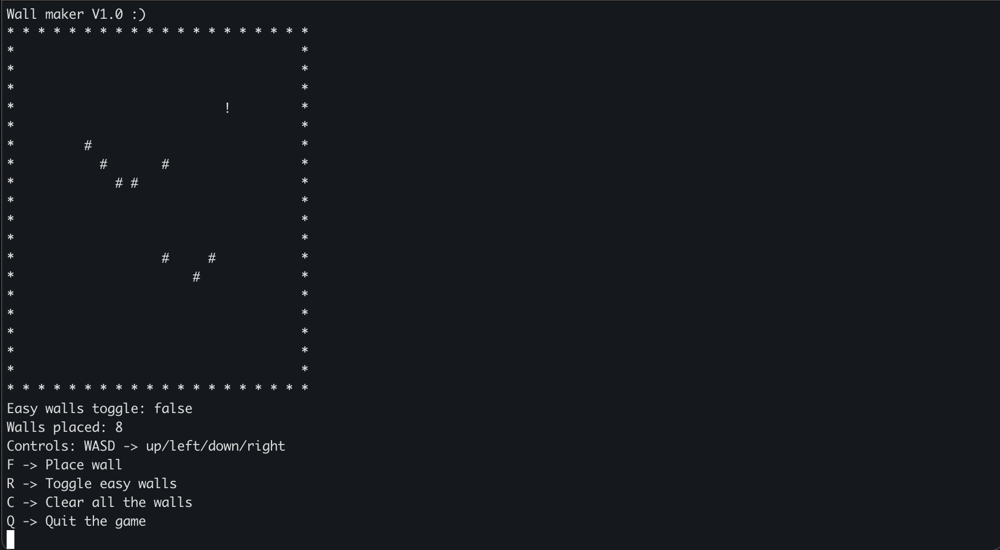

This project is licensed under the [MIT License](LICENSE).
# MicroEngine
**A simple terminal based game (game engine) based in C++.**

---

This library is suposed to be a fun little "game engine" or standalone game just to show off how much fun a terminal can be

---

### ✨ Features

If you want to use it as your own "game engine" its super simple, it currently 
supports "game" objects which by default is a 2D matrix map.



---

### 📦 Overview

To create a game map you simply do the following 

```cpp
Game objectName(30,30)            //Creates a 2D 30x30 map 
```
Game objects can be "rendered" using the ```render()``` method.

It's advised to render in a loop and also use a built in delay() function
which is a basic C++ function wrapped in a nice interface. 

Use like:

```cpp
delay(1000)          //1000ms delay
```

To move the player use the  ``` walk(char dir) ``` method.

It also supports wall objects which are stored in a dynamically allocated array of pair variables.


---

### 🚧 Work in progress:

-Make different type of walls

-Add objectives

---

## 🙋‍♂️ Who am I?

I'm Omar, a software engineering student working on cool micro-libraries
and low-level C++ experiments. This is a part of my learning journey and
portfolio, and I'm having a blast building it.
